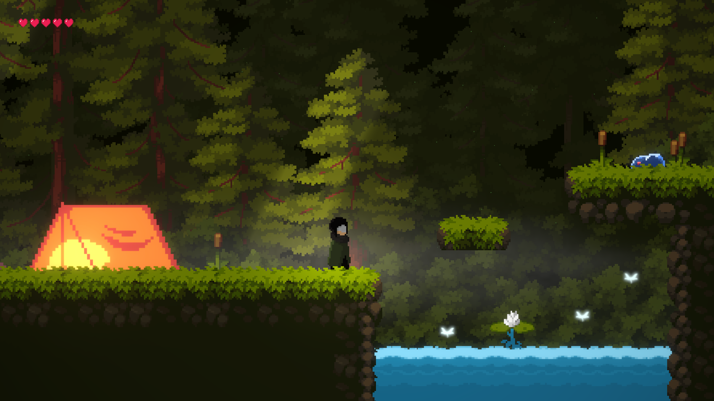
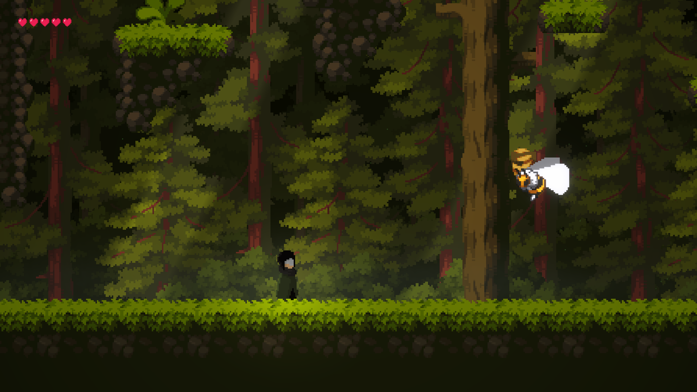
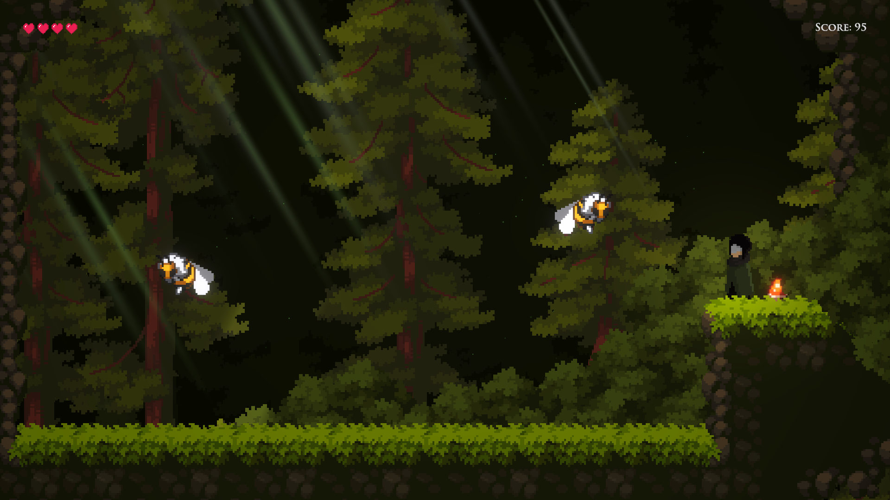
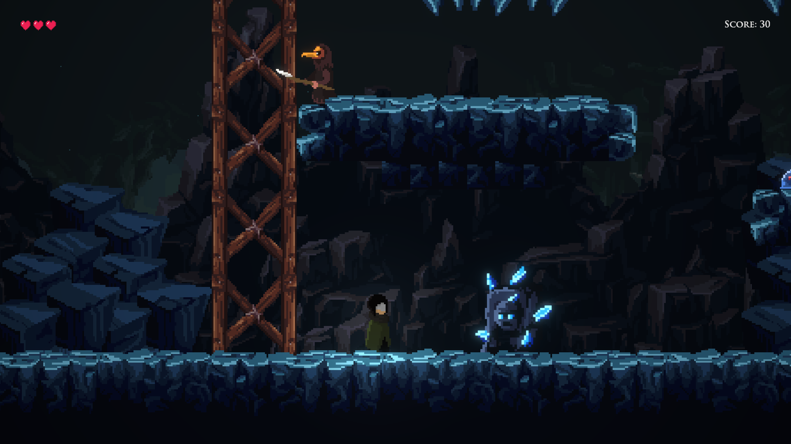
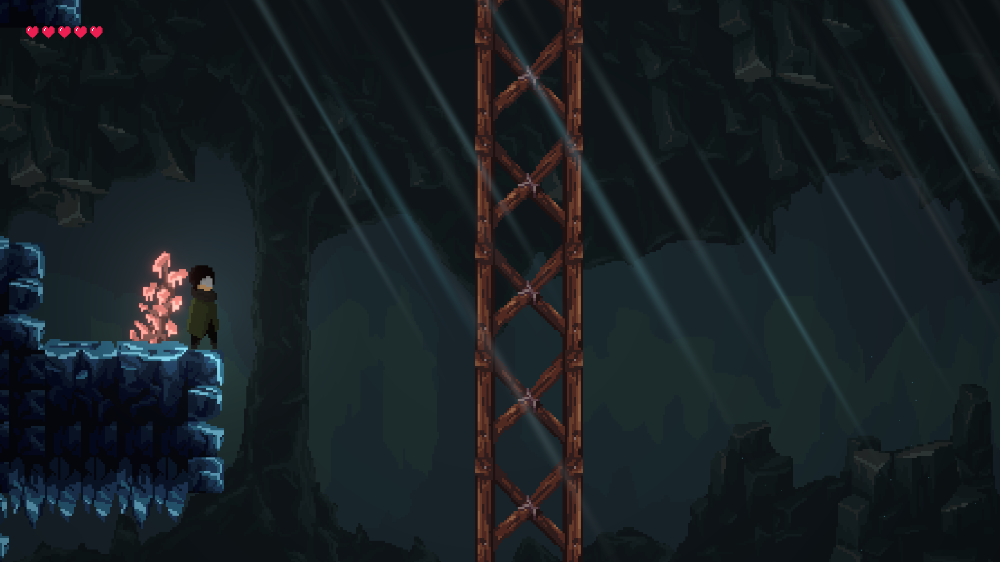
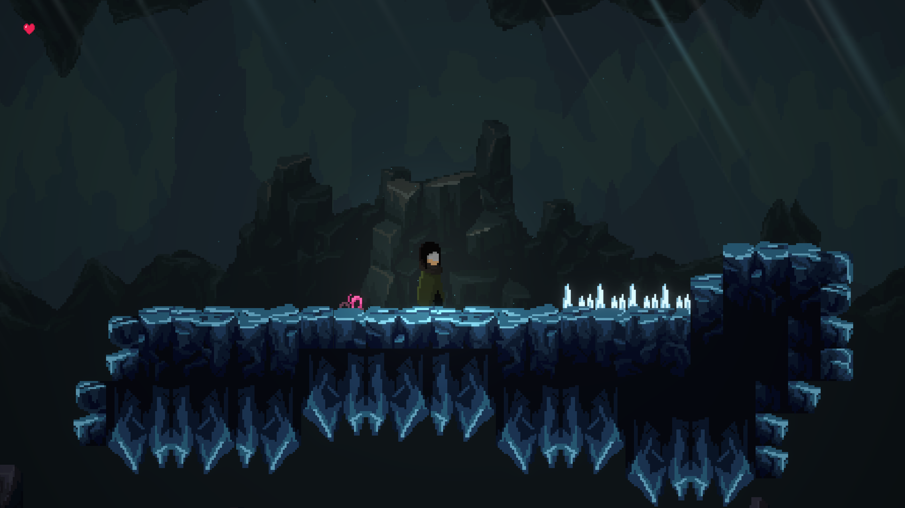

# Stellar Camp Game

Um jogo 2d desenvolvido em **Unity**.

Explore mapas interligados, enfrente inimigos com IA de patrulha, desbloqueie novas habilidades e desvende os mistérios do jogo.

## 🚀 Como Rodar o Projeto

1. Clone o repositório:
   ```bash
   git clone https://github.com/izraelzz/stellar-camp-game.git
   ```
2. Abra o **Unity Hub**.
3. Clique em **Add** e selecione a pasta do projeto clonado.
4. Abra o projeto com a versão do Unity compatível (verifique em `ProjectSettings`).
5. Abra a cena principal em `Project/Scenes/SampleScene` e clique em **Play**.

## 📸 Imagens do Jogo

| | | |
|---|---|---|
|  |  |  |
|  |  |  |
